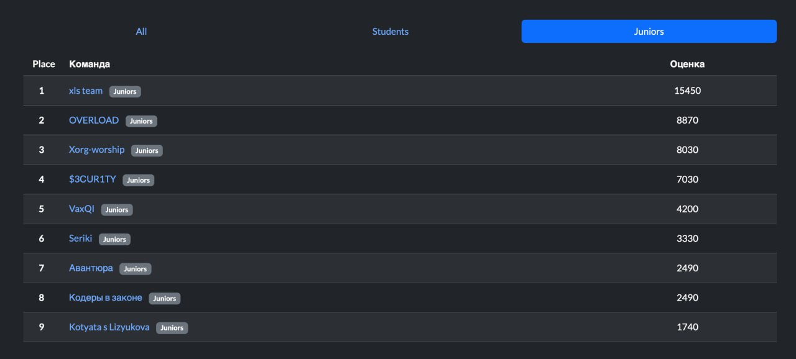

# VRN CTF 7 Quals Challenges

Соревнования проходили 17 мая в  offline-формате при поддержке Минцифры и Воронежского Государственного Университета (Факультет компьютерных наук) на площадке Дворца творчества и юности. В соревновании приняли участие 20 лучших команд в секциях "Студенты" и "Юниоры", отобранные по результатам online отбора

[Сайт соревнований](https://vrnctf.ru)  
[Caйт чемпионата](https://cybercraft.ru)

## Таблица финалистов этапа "Юниоры"

## Таблица финалистов этапа "Студенты"

## Таблица финалистов этапа "Сводная таблица"

